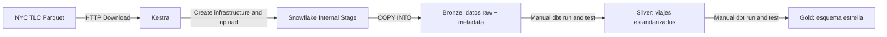
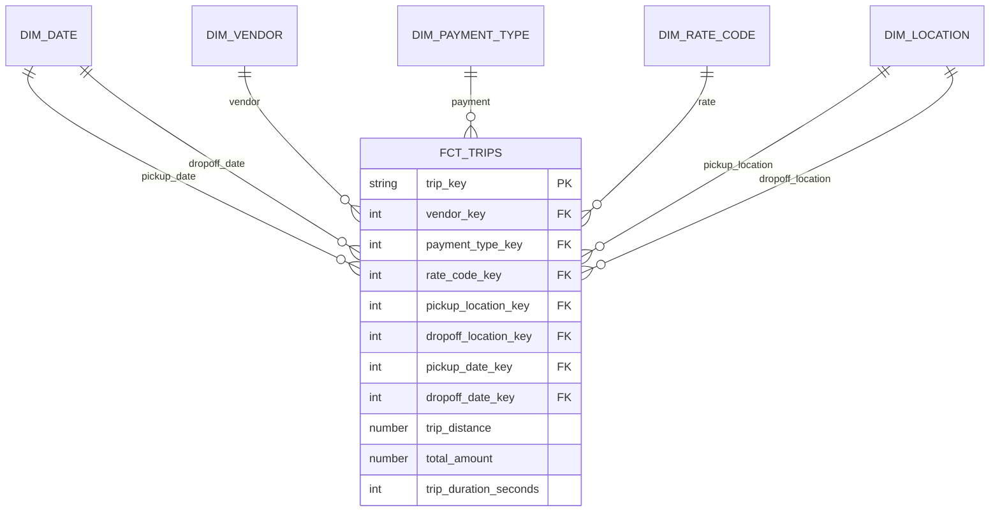

# Laboratorio Integrador I — NYC Yellow Taxi

Pipeline ELT reproducible con Kestra, Snowflake y dbt para los viajes de NYC
Yellow Taxi de enero de 2025 a julio de 2026. El flujo queda preparado para
incorporar agosto de 2026 cuando el archivo oficial esté disponible.

## Arquitectura



## Esquema estrella



El grano de `GOLD.FCT_TRIPS` es una fila por viaje válido y deduplicado.

## Ejecución

1. Copiar `.env.example` a `.env` y completar las credenciales.
2. Levantar la infraestructura con `docker compose up -d`.
3. Abrir Kestra en `http://localhost:8080`, crear un flow y pegar el contenido
   de `kestra/nyc_yellow_taxi_elt.yaml`.
4. Guardar y ejecutar el flow. Kestra crea automáticamente el warehouse si no
   existe, la base, los schemas, las tablas Bronze, el stage y el file format.
5. Cuando el flow termine correctamente, ejecutar dbt manualmente siguiendo la
   sección siguiente.

No se debe ejecutar ningún script de creación manual en Snowflake. La cuenta y
el rol configurados en `.env` sí deben tener permisos para crear estos objetos.

El trigger mensual está incluido pero deshabilitado para evitar ejecuciones
involuntarias durante el desarrollo.

## Ejecución manual de dbt

Kestra termina en Bronze. Las transformaciones Silver y Gold se ejecutan desde
el contenedor `dbt`, de forma separada y manual.

Primero verificar la conexión:

```powershell
docker compose exec dbt dbt debug --profiles-dir .
```

Construir y probar Silver:

```powershell
docker compose exec dbt dbt run --profiles-dir . --select path:models/silver
docker compose exec dbt dbt test --profiles-dir . --select path:models/silver
```

Construir y probar Gold:

```powershell
docker compose exec dbt dbt run --profiles-dir . --select path:models/gold
docker compose exec dbt dbt test --profiles-dir . --select path:models/gold
```

También se puede reconstruir y probar todo el proyecto en un solo comando:

```powershell
docker compose exec dbt dbt build --profiles-dir . --full-refresh
```

Un `dbt test` exitoso valida las pruebas `not_null`, `unique` y
`relationships` definidas en los archivos `schema.yml`.

## Idempotencia

Antes de cargar cada Parquet, el flow elimina de Bronze las filas del mismo
período. Una ejecución completada correctamente reemplaza ese mes y no genera
duplicados al repetirse. Si la carga falla después de la eliminación, se puede
volver a ejecutar el mismo período para restaurarlo. Los modelos dbt son tablas
reconstruibles; `dbt build --full-refresh` vuelve a crear Silver y Gold a partir
del estado actual de Bronze.

## Decisiones de calidad en Silver

- Los campos se convierten con `TRY_TO_*` para evitar conversiones implícitas.
- Los nulos categóricos se asignan a valores conocidos de `Unknown`.
- Los viajes sin fechas o ubicaciones válidas se excluyen.
- Se excluyen duraciones negativas, distancias negativas y totales negativos.
- Los duplicados exactos se eliminan mediante una llave hash estable.
- Se conserva `source_file`, `source_period` y `loaded_at` para trazabilidad.

## Disponibilidad de agosto de 2026

Al 28 de septiembre de 2026, TLC publica archivos hasta julio de 2026. Por ese
motivo, la entrega procesa los 19 meses disponibles entre enero de 2025 y julio
de 2026. La ausencia temporal de agosto fue aceptada para la entrega. Cuando el
archivo esté disponible, se debe agregar `"2026-08"` al input `periods`, ejecutar
ese período en Kestra y reconstruir Silver y Gold con dbt.
