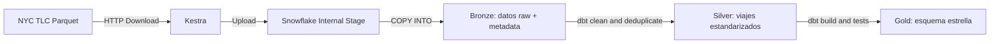
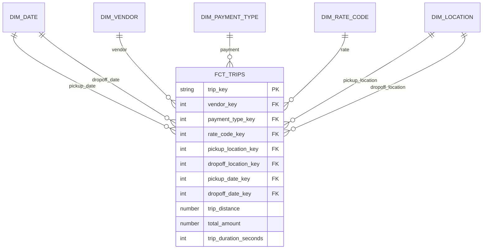

# Laboratorio Integrador I — NYC Yellow Taxi

Pipeline ELT reproducible con Kestra, Snowflake y dbt para los viajes de NYC
Yellow Taxi de enero de 2025 a agosto de 2026.

## Arquitectura

## Esquema estrella

El grano de `GOLD.FCT_TRIPS` es una fila por viaje válido y deduplicado.

## Ejecución

1. Copiar `.env.example` a `.env` y completar las credenciales.
2. Levantar la infraestructura con `docker compose up -d`.
3. Ejecutar `snowflake/setup.sql` en un Worksheet de Snowflake.
4. Confirmar que este proyecto esté publicado en la rama `main` de GitHub.
5. Abrir Kestra en `http://localhost:8080`, crear un flow y pegar el contenido
   de `kestra/nyc_yellow_taxi_elt.yaml`.
6. Guardar y ejecutar el flow. Al terminar deben existir las tablas de las
   capas `BRONZE`, `SILVER` y `GOLD` y todos los tests de dbt deben pasar.

El trigger mensual está incluido pero deshabilitado para evitar ejecuciones
involuntarias durante el desarrollo.

## Idempotencia

Cada período se reemplaza dentro de una transacción antes de volver a cargar su
Parquet. Los modelos dbt se reconstruyen con `--full-refresh`, por lo que repetir
el flow no crea duplicados.

## Decisiones de calidad en Silver

- Los campos se convierten con `TRY_TO_*` para evitar conversiones implícitas.
- Los nulos categóricos se asignan a valores conocidos de `Unknown`.
- Los viajes sin fechas o ubicaciones válidas se excluyen.
- Se excluyen duraciones negativas, distancias negativas y totales negativos.
- Los duplicados exactos se eliminan mediante una llave hash estable.
- Se conserva `source_file`, `source_period` y `loaded_at` para trazabilidad.

## Disponibilidad de agosto de 2026

Al 28 de septiembre de 2026, TLC publica archivos hasta julio de 2026. La URL
de agosto todavía responde `403`. Cuando esté disponible, agregar `"2026-08"`
al input `periods` del flow y volver a ejecutarlo.
